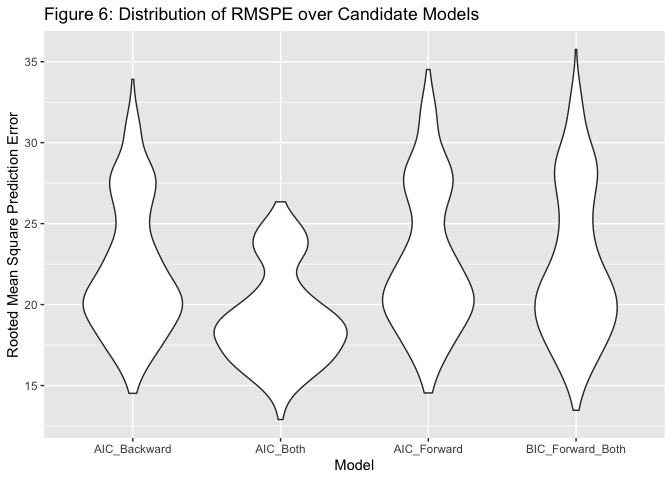

Final Project
================
KaiYu He(kh3074)
12/11/2021

``` r
library(tidyverse)
```

    ## ── Attaching packages ─────────────────────────────────────── tidyverse 1.3.1 ──

    ## ✓ ggplot2 3.3.5     ✓ purrr   0.3.4
    ## ✓ tibble  3.1.5     ✓ dplyr   1.0.7
    ## ✓ tidyr   1.1.3     ✓ stringr 1.4.0
    ## ✓ readr   2.0.1     ✓ forcats 0.5.1

    ## ── Conflicts ────────────────────────────────────────── tidyverse_conflicts() ──
    ## x dplyr::filter() masks stats::filter()
    ## x dplyr::lag()    masks stats::lag()

``` r
library(skimr)
library(patchwork)
library(MASS)
```

    ## 
    ## Attaching package: 'MASS'

    ## The following object is masked from 'package:patchwork':
    ## 
    ##     area

    ## The following object is masked from 'package:dplyr':
    ## 
    ##     select

``` r
library(leaps)
library(mgcv)
```

    ## Loading required package: nlme

    ## 
    ## Attaching package: 'nlme'

    ## The following object is masked from 'package:dplyr':
    ## 
    ##     collapse

    ## This is mgcv 1.8-36. For overview type 'help("mgcv-package")'.

``` r
library(performance)
```

``` r
# data clean (calculate crime_rate (1000 people))
crime_rate_df = read_csv("data/cdi.csv") %>%
  mutate(crime_rate = crimes /(pop/1000),
         region = case_when(
    region == 1 ~ "Northeast",
    region == 2 ~ "North Central",
    region == 3 ~ "South",
    region == 4 ~ "West"
  ),
  region = factor(region))
```

    ## Rows: 440 Columns: 17

    ## ── Column specification ────────────────────────────────────────────────────────
    ## Delimiter: ","
    ## chr  (2): cty, state
    ## dbl (15): id, area, pop, pop18, pop65, docs, beds, crimes, hsgrad, bagrad, p...

    ## 
    ## ℹ Use `spec()` to retrieve the full column specification for this data.
    ## ℹ Specify the column types or set `show_col_types = FALSE` to quiet this message.

``` r
# check outliers
OutVals = boxplot(crime_rate_df$crime_rate)$out
```

<!-- -->

``` r
crime_rate_df %>% 
  dplyr::filter(crime_rate %in% OutVals) %>% 
  dplyr::select(state, crime_rate, cty) %>% 
  knitr::kable(caption = "Outliers in Crime Rate")
```

| state | crime\_rate | cty       |
|:------|------------:|:----------|
| NY    |    295.9867 | Kings     |
| FL    |    126.3362 | Dade      |
| GA    |    143.3467 | Fulton    |
| MO    |    161.5967 | St.\_Loui |

Outliers in Crime Rate

``` r
crime_rate_df %>% 
  group_by(region) %>% 
  count() %>% 
  knitr::kable(caption = "Number of Observations in Each Region") 
```

| region        |   n |
|:--------------|----:|
| North Central | 108 |
| Northeast     | 103 |
| South         | 152 |
| West          |  77 |

Number of Observations in Each Region

``` r
# numeric variables
crime_rate_df_numeric  =
  crime_rate_df%>%
  dplyr::select(area,pop18,pop65,docs,beds,hsgrad,bagrad,poverty,unemp,
                pcincome,totalinc,crime_rate)%>%
  filter(beds<10000,docs<10000)

# marginal distribution
crime_rate_df_numeric %>%
  pivot_longer(area:crime_rate,names_to = "predictors",values_to = "value")%>%
  ggplot(aes(x = value))+
  geom_density()+
  facet_wrap(.~predictors,scales = "free") + 
  labs(
    title = "Figure 2: Marginal Distribution of Numerical Variables"
  )
```

<!-- -->

``` r
## Variable Selection
# numerical variables
crime_rate_df %>%
  dplyr::select(crime_rate,area,pop18,pop65,docs,beds,hsgrad,bagrad,
                poverty,unemp,totalinc,pcincome) %>%
  pivot_longer(area:pcincome, names_to = "predictor", values_to = "value") %>%
  ggplot(aes(x = value, y = crime_rate)) +
  geom_point() +
  geom_smooth(method = "lm", se = F) +
  facet_wrap(.~predictor, scales = "free") +
  labs(title = "Figure 3: Scatterplots of crime rate vs. numerical predictor variables",
       x = "Predictor Variable",
       y = "Crime Rate Per 1000 People")
```

    ## `geom_smooth()` using formula 'y ~ x'

<!-- -->

``` r
#categorical variable
crime_rate_df%>%
  ggplot(aes(x = fct_reorder(region,crime_rate),y=crime_rate))+
  geom_boxplot() + 
  labs(
    title = "Figure 4: Boxplot of Crime Rate over Region",
    x = "Region",
    y = "Crime Rate per 1000 People"
  )
```

<!-- -->

``` r
crime_rate_df_all = crime_rate_df %>%
  dplyr::select(crime_rate,pop18,docs,beds,poverty,totalinc,region)

#interaction term
crime_rate_df_all %>%
  pivot_longer(pop18:totalinc, names_to = "predictor", values_to = "value") %>%
  ggplot(aes(x = value,y = crime_rate,color = region)) +
  geom_point() +
  geom_smooth(method = "lm",se = F) +
  facet_wrap(.~predictor, scales = "free") +
  labs(
    title = "Figure 5: Interaction Check",
    y = "Crime Rate"
  )
```

    ## `geom_smooth()` using formula 'y ~ x'

<!-- -->

``` r
#stepwise procedure with AIC and BIC
lm0 = lm(data = crime_rate_df_all, crime_rate ~ pop18 + docs + beds + 
           poverty + totalinc + region + docs*region + beds*region + 
           poverty*region + totalinc*region)

step(lm0 , direction = "backward", scope = ~pop18 + docs + beds +
       poverty + totalinc + region + docs*region + beds*region + 
       poverty*region + totalinc*region)
```

    ## Start:  AIC=2608.47
    ## crime_rate ~ pop18 + docs + beds + poverty + totalinc + region + 
    ##     docs * region + beds * region + poverty * region + totalinc * 
    ##     region
    ## 
    ##                   Df Sum of Sq    RSS    AIC
    ## - beds:region      3    1532.4 151723 2606.9
    ## <none>                         150190 2608.5
    ## - poverty:region   3    3143.9 153334 2611.6
    ## - docs:region      3    8227.4 158418 2625.9
    ## - pop18            1    7032.6 157223 2626.6
    ## - totalinc:region  3   10271.2 160461 2631.6
    ## 
    ## Step:  AIC=2606.94
    ## crime_rate ~ pop18 + docs + beds + poverty + totalinc + region + 
    ##     docs:region + poverty:region + totalinc:region
    ## 
    ##                   Df Sum of Sq    RSS    AIC
    ## <none>                         151723 2606.9
    ## - poverty:region   3    7212.5 158935 2621.4
    ## - docs:region      3    7801.7 159524 2623.0
    ## - pop18            1    7385.0 159108 2625.8
    ## - beds             1    9386.9 161110 2631.3
    ## - totalinc:region  3   13035.4 164758 2637.2

    ## 
    ## Call:
    ## lm(formula = crime_rate ~ pop18 + docs + beds + poverty + totalinc + 
    ##     region + docs:region + poverty:region + totalinc:region, 
    ##     data = crime_rate_df_all)
    ## 
    ## Coefficients:
    ##              (Intercept)                     pop18                      docs  
    ##                4.740e-01                 1.020e+00                -9.628e-04  
    ##                     beds                   poverty                  totalinc  
    ##                8.601e-03                 2.136e+00                -1.056e-03  
    ##          regionNortheast               regionSouth                regionWest  
    ##               -2.997e+01                 2.158e+01                 2.627e+01  
    ##     docs:regionNortheast          docs:regionSouth           docs:regionWest  
    ##               -1.626e-02                 1.887e-03                 4.448e-03  
    ##  poverty:regionNortheast       poverty:regionSouth        poverty:regionWest  
    ##                1.597e+00                -1.215e+00                -1.611e+00  
    ## totalinc:regionNortheast      totalinc:regionSouth       totalinc:regionWest  
    ##                3.771e-03                 5.282e-04                -4.698e-04

``` r
lm1_AIC_Backward = lm(formula = crime_rate ~ pop18 + docs + beds +
                        poverty + totalinc + region + docs:region +
                        poverty:region + totalinc:region, 
    data = crime_rate_df_all)

lm_null = lm(crime_rate ~ NULL, data = crime_rate_df_all)

step(lm_null,direction = "forward", scope = ~pop18 + docs + beds +
       poverty + totalinc + region + docs*region + beds*region +
       poverty*region + totalinc*region)
```

    ## Start:  AIC=2911.95
    ## crime_rate ~ NULL
    ## 
    ##            Df Sum of Sq    RSS    AIC
    ## + poverty   1     72991 254856 2803.1
    ## + region    3     59181 268666 2830.4
    ## + beds      1     50254 277593 2840.7
    ## + docs      1     31006 296841 2870.2
    ## + totalinc  1     17066 310781 2890.4
    ## + pop18     1     11906 315941 2897.7
    ## <none>                  327847 2911.9
    ## 
    ## Step:  AIC=2803.14
    ## crime_rate ~ poverty
    ## 
    ##            Df Sum of Sq    RSS    AIC
    ## + beds      1     32473 222383 2745.2
    ## + docs      1     25308 229548 2759.1
    ## + region    3     25920 228936 2761.9
    ## + totalinc  1     19940 234916 2769.3
    ## + pop18     1      9999 244857 2787.5
    ## <none>                  254856 2803.1
    ## 
    ## Step:  AIC=2745.17
    ## crime_rate ~ poverty + beds
    ## 
    ##            Df Sum of Sq    RSS    AIC
    ## + region    3     31631 190752 2683.7
    ## + pop18     1      7681 214703 2731.7
    ## + totalinc  1      4298 218086 2738.6
    ## + docs      1      1991 220393 2743.2
    ## <none>                  222383 2745.2
    ## 
    ## Step:  AIC=2683.66
    ## crime_rate ~ poverty + beds + region
    ## 
    ##                  Df Sum of Sq    RSS    AIC
    ## + beds:region     3   16454.2 174298 2650.0
    ## + totalinc        1    8049.9 182702 2666.7
    ## + pop18           1    4784.1 185968 2674.5
    ## + poverty:region  3    6410.1 184342 2674.6
    ## + docs            1    3654.2 187098 2677.2
    ## <none>                        190752 2683.7
    ## 
    ## Step:  AIC=2649.97
    ## crime_rate ~ poverty + beds + region + beds:region
    ## 
    ##                  Df Sum of Sq    RSS    AIC
    ## + pop18           1    5458.7 168839 2638.0
    ## + poverty:region  3    4679.6 169618 2644.0
    ## + totalinc        1    1302.4 172996 2648.7
    ## + docs            1     996.4 173302 2649.4
    ## <none>                        174298 2650.0
    ## 
    ## Step:  AIC=2637.97
    ## crime_rate ~ poverty + beds + region + pop18 + beds:region
    ## 
    ##                  Df Sum of Sq    RSS    AIC
    ## + poverty:region  3    5216.7 163623 2630.2
    ## + docs            1    2128.7 166711 2634.4
    ## + totalinc        1    1303.2 167536 2636.6
    ## <none>                        168839 2638.0
    ## 
    ## Step:  AIC=2630.16
    ## crime_rate ~ poverty + beds + region + pop18 + beds:region + 
    ##     poverty:region
    ## 
    ##            Df Sum of Sq    RSS    AIC
    ## + docs      1    812.37 162810 2630.0
    ## <none>                  163623 2630.2
    ## + totalinc  1    300.08 163323 2631.3
    ## 
    ## Step:  AIC=2629.97
    ## crime_rate ~ poverty + beds + region + pop18 + docs + beds:region + 
    ##     poverty:region
    ## 
    ##               Df Sum of Sq    RSS    AIC
    ## + docs:region  3   2341.18 160469 2629.6
    ## <none>                     162810 2630.0
    ## + totalinc     1     23.55 162787 2631.9
    ## 
    ## Step:  AIC=2629.6
    ## crime_rate ~ poverty + beds + region + pop18 + docs + beds:region + 
    ##     poverty:region + region:docs
    ## 
    ##            Df Sum of Sq    RSS    AIC
    ## <none>                  160469 2629.6
    ## + totalinc  1    7.7494 160461 2631.6

    ## 
    ## Call:
    ## lm(formula = crime_rate ~ poverty + beds + region + pop18 + docs + 
    ##     beds:region + poverty:region + region:docs, data = crime_rate_df_all)
    ## 
    ## Coefficients:
    ##             (Intercept)                  poverty                     beds  
    ##               -2.786098                 2.862269                 0.005634  
    ##         regionNortheast              regionSouth               regionWest  
    ##               -6.683888                25.333997                24.204093  
    ##                   pop18                     docs     beds:regionNortheast  
    ##                0.926816                -0.004050                 0.010312  
    ##        beds:regionSouth          beds:regionWest  poverty:regionNortheast  
    ##                0.001178                -0.008477                -1.097024  
    ##     poverty:regionSouth       poverty:regionWest     regionNortheast:docs  
    ##               -1.764222                -1.610593                -0.005814  
    ##        regionSouth:docs          regionWest:docs  
    ##                0.004420                 0.008751

``` r
lm2_AIC_Forward = lm(formula = crime_rate ~ poverty + beds + region + 
                       pop18 + docs + beds:region + poverty:region +
                       region:docs, data = crime_rate_df_all)

step(lm_null,direction = "both", scope = ~pop18 + docs + beds +
       poverty + totalinc + region + docs*region + beds*region +
       poverty*region + totalinc*region)
```

    ## Start:  AIC=2911.95
    ## crime_rate ~ NULL
    ## 
    ##            Df Sum of Sq    RSS    AIC
    ## + poverty   1     72991 254856 2803.1
    ## + region    3     59181 268666 2830.4
    ## + beds      1     50254 277593 2840.7
    ## + docs      1     31006 296841 2870.2
    ## + totalinc  1     17066 310781 2890.4
    ## + pop18     1     11906 315941 2897.7
    ## <none>                  327847 2911.9
    ## 
    ## Step:  AIC=2803.14
    ## crime_rate ~ poverty
    ## 
    ##            Df Sum of Sq    RSS    AIC
    ## + beds      1     32473 222383 2745.2
    ## + docs      1     25308 229548 2759.1
    ## + region    3     25920 228936 2761.9
    ## + totalinc  1     19940 234916 2769.3
    ## + pop18     1      9999 244857 2787.5
    ## <none>                  254856 2803.1
    ## - poverty   1     72991 327847 2911.9
    ## 
    ## Step:  AIC=2745.17
    ## crime_rate ~ poverty + beds
    ## 
    ##            Df Sum of Sq    RSS    AIC
    ## + region    3     31631 190752 2683.7
    ## + pop18     1      7681 214703 2731.7
    ## + totalinc  1      4298 218086 2738.6
    ## + docs      1      1991 220393 2743.2
    ## <none>                  222383 2745.2
    ## - beds      1     32473 254856 2803.1
    ## - poverty   1     55209 277593 2840.7
    ## 
    ## Step:  AIC=2683.66
    ## crime_rate ~ poverty + beds + region
    ## 
    ##                  Df Sum of Sq    RSS    AIC
    ## + beds:region     3     16454 174298 2650.0
    ## + totalinc        1      8050 182702 2666.7
    ## + pop18           1      4784 185968 2674.5
    ## + poverty:region  3      6410 184342 2674.6
    ## + docs            1      3654 187098 2677.2
    ## <none>                        190752 2683.7
    ## - poverty         1     24941 215694 2735.7
    ## - region          3     31631 222383 2745.2
    ## - beds            1     38184 228936 2761.9
    ## 
    ## Step:  AIC=2649.97
    ## crime_rate ~ poverty + beds + region + beds:region
    ## 
    ##                  Df Sum of Sq    RSS    AIC
    ## + pop18           1    5458.7 168839 2638.0
    ## + poverty:region  3    4679.6 169618 2644.0
    ## + totalinc        1    1302.4 172996 2648.7
    ## + docs            1     996.4 173302 2649.4
    ## <none>                        174298 2650.0
    ## - beds:region     3   16454.2 190752 2683.7
    ## - poverty         1   19184.8 193483 2693.9
    ## 
    ## Step:  AIC=2637.97
    ## crime_rate ~ poverty + beds + region + pop18 + beds:region
    ## 
    ##                  Df Sum of Sq    RSS    AIC
    ## + poverty:region  3    5216.7 163623 2630.2
    ## + docs            1    2128.7 166711 2634.4
    ## + totalinc        1    1303.2 167536 2636.6
    ## <none>                        168839 2638.0
    ## - pop18           1    5458.7 174298 2650.0
    ## - beds:region     3   17128.8 185968 2674.5
    ## - poverty         1   19386.0 188225 2683.8
    ## 
    ## Step:  AIC=2630.16
    ## crime_rate ~ poverty + beds + region + pop18 + beds:region + 
    ##     poverty:region
    ## 
    ##                  Df Sum of Sq    RSS    AIC
    ## + docs            1     812.4 162810 2630.0
    ## <none>                        163623 2630.2
    ## + totalinc        1     300.1 163323 2631.3
    ## - poverty:region  3    5216.7 168839 2638.0
    ## - pop18           1    5995.7 169618 2644.0
    ## - beds:region     3   15445.8 179069 2663.8
    ## 
    ## Step:  AIC=2629.97
    ## crime_rate ~ poverty + beds + region + pop18 + docs + beds:region + 
    ##     poverty:region
    ## 
    ##                  Df Sum of Sq    RSS    AIC
    ## + docs:region     3    2341.2 160469 2629.6
    ## <none>                        162810 2630.0
    ## - docs            1     812.4 163623 2630.2
    ## + totalinc        1      23.6 162787 2631.9
    ## - poverty:region  3    3900.3 166711 2634.4
    ## - pop18           1    6610.1 169420 2645.5
    ## - beds:region     3   13039.8 175850 2657.9
    ## 
    ## Step:  AIC=2629.6
    ## crime_rate ~ poverty + beds + region + pop18 + docs + beds:region + 
    ##     poverty:region + region:docs
    ## 
    ##                  Df Sum of Sq    RSS    AIC
    ## - poverty:region  3    2063.4 162533 2629.2
    ## <none>                        160469 2629.6
    ## - region:docs     3    2341.2 162810 2630.0
    ## + totalinc        1       7.7 160461 2631.6
    ## - beds:region     3    4369.2 164838 2635.4
    ## - pop18           1    6212.5 166682 2644.3
    ## 
    ## Step:  AIC=2629.22
    ## crime_rate ~ poverty + beds + region + pop18 + docs + beds:region + 
    ##     region:docs
    ## 
    ##                  Df Sum of Sq    RSS    AIC
    ## <none>                        162533 2629.2
    ## + poverty:region  3    2063.4 160469 2629.6
    ## + totalinc        1      77.2 162455 2631.0
    ## - region:docs     3    4178.1 166711 2634.4
    ## - beds:region     3    6523.4 169056 2640.5
    ## - pop18           1    6088.1 168621 2643.4
    ## - poverty         1   13297.1 175830 2661.8

    ## 
    ## Call:
    ## lm(formula = crime_rate ~ poverty + beds + region + pop18 + docs + 
    ##     beds:region + region:docs, data = crime_rate_df_all)
    ## 
    ## Coefficients:
    ##          (Intercept)               poverty                  beds  
    ##             7.534119              1.372741              0.010124  
    ##      regionNortheast           regionSouth            regionWest  
    ##           -14.621754             12.631125             13.051572  
    ##                pop18                  docs  beds:regionNortheast  
    ##             0.917202             -0.009752              0.006845  
    ##     beds:regionSouth       beds:regionWest  regionNortheast:docs  
    ##            -0.003905             -0.013287             -0.001109  
    ##     regionSouth:docs       regionWest:docs  
    ##             0.010808              0.014825

``` r
lm3_AIC_Both = lm(formula = crime_rate ~ poverty + beds + region +
                    pop18 + docs + 
    beds:region + region:docs, data = crime_rate_df_all)

step(lm_null,direction = "forward", k = log(nrow(crime_rate_df)), 
     scope = ~pop18 + docs + beds + poverty + totalinc + region + 
       docs*region + beds*region + poverty*region + totalinc*region)
```

    ## Start:  AIC=2916.04
    ## crime_rate ~ NULL
    ## 
    ##            Df Sum of Sq    RSS    AIC
    ## + poverty   1     72991 254856 2811.3
    ## + region    3     59181 268666 2846.7
    ## + beds      1     50254 277593 2848.9
    ## + docs      1     31006 296841 2878.4
    ## + totalinc  1     17066 310781 2898.6
    ## + pop18     1     11906 315941 2905.8
    ## <none>                  327847 2916.0
    ## 
    ## Step:  AIC=2811.31
    ## crime_rate ~ poverty
    ## 
    ##            Df Sum of Sq    RSS    AIC
    ## + beds      1     32473 222383 2757.4
    ## + docs      1     25308 229548 2771.4
    ## + totalinc  1     19940 234916 2781.6
    ## + region    3     25920 228936 2782.4
    ## + pop18     1      9999 244857 2799.8
    ## <none>                  254856 2811.3
    ## 
    ## Step:  AIC=2757.43
    ## crime_rate ~ poverty + beds
    ## 
    ##            Df Sum of Sq    RSS    AIC
    ## + region    3     31631 190752 2708.2
    ## + pop18     1      7681 214703 2748.1
    ## + totalinc  1      4298 218086 2754.9
    ## <none>                  222383 2757.4
    ## + docs      1      1991 220393 2759.6
    ## 
    ## Step:  AIC=2708.18
    ## crime_rate ~ poverty + beds + region
    ## 
    ##                  Df Sum of Sq    RSS    AIC
    ## + beds:region     3   16454.2 174298 2686.8
    ## + totalinc        1    8049.9 182702 2695.3
    ## + pop18           1    4784.1 185968 2703.1
    ## + docs            1    3654.2 187098 2705.8
    ## <none>                        190752 2708.2
    ## + poverty:region  3    6410.1 184342 2711.4
    ## 
    ## Step:  AIC=2686.75
    ## crime_rate ~ poverty + beds + region + beds:region
    ## 
    ##                  Df Sum of Sq    RSS    AIC
    ## + pop18           1    5458.7 168839 2678.8
    ## <none>                        174298 2686.8
    ## + totalinc        1    1302.4 172996 2689.5
    ## + docs            1     996.4 173302 2690.3
    ## + poverty:region  3    4679.6 169618 2693.0
    ## 
    ## Step:  AIC=2678.84
    ## crime_rate ~ poverty + beds + region + pop18 + beds:region
    ## 
    ##                  Df Sum of Sq    RSS    AIC
    ## <none>                        168839 2678.8
    ## + docs            1    2128.7 166711 2679.3
    ## + totalinc        1    1303.2 167536 2681.5
    ## + poverty:region  3    5216.7 163623 2683.3

    ## 
    ## Call:
    ## lm(formula = crime_rate ~ poverty + beds + region + pop18 + beds:region, 
    ##     data = crime_rate_df_all)
    ## 
    ## Coefficients:
    ##          (Intercept)               poverty                  beds  
    ##             9.142708              1.564495              0.003597  
    ##      regionNortheast           regionSouth            regionWest  
    ##           -15.299429             11.035808             11.423984  
    ##                pop18  beds:regionNortheast      beds:regionSouth  
    ##             0.851586              0.005259              0.003171  
    ##      beds:regionWest  
    ##            -0.002329

``` r
lm4_BIC_Forward_Both = lm(formula = crime_rate ~ poverty + beds + region +
                            pop18 + beds:region, 
    data = crime_rate_df_all)
```

``` r
library(modelr)
```

    ## 
    ## Attaching package: 'modelr'

    ## The following objects are masked from 'package:performance':
    ## 
    ##     mae, mse, rmse

``` r
set.seed(1200)
#cross-validation
cv_df <-
  crossv_mc(crime_rate_df_all, 500)
cv_df <-
  cv_df %>% 
  mutate(
    train = map(train, as_tibble),
    test = map(test, as_tibble)
  )

cv_df_result <-
  cv_df %>% 
  mutate(
    lm1_AIC_Backward = map(.x = train, ~lm(crime_rate ~ pop18 +
                                             docs + beds + poverty + 
                                             totalinc + region + docs:region +
                                             poverty:region + totalinc:region,
                                           data = .x)),
    lm2_AIC_Forward = map(.x = train, ~lm(crime_rate ~ pop18 + docs +
                                            beds + poverty + totalinc + 
    region + docs:region + beds:region + poverty:region + totalinc:region,
    data = .x, )),
    lm3_AIC_Both = map(.x = train, ~lm(crime_rate ~ poverty + beds + region +
                                         pop18 + docs + 
    beds:region + region:docs, data = crime_rate_df_all)),
    lm4_BIC_Forward_Both = map(.x = train, ~lm(crime_rate ~ poverty + beds +
                                                 region + pop18 + beds:region,
                                               data = .x))
    ) %>% 
  mutate(
    rmse_AIC_Backward = map2_dbl(.x = lm1_AIC_Backward,
                                 .y = test, 
                                 ~rmse(model = .x, data = .y)),
    rmse_AIC_Forward = map2_dbl(.x = lm2_AIC_Forward, .y = test,
                                ~rmse(model = .x, data = .y)),
    rmse_AIC_Both = map2_dbl(.x = lm3_AIC_Both, .y = test, 
                             ~rmse(model = .x, data = .y)),
    rmse_BIC_Forward_Both = map2_dbl(.x = lm4_BIC_Forward_Both, 
                                     .y = test, 
                                     ~rmse(model = .x, data = .y))
  )

cv_df_result %>% 
  dplyr::select(starts_with("rmse")) %>% 
  pivot_longer(
    rmse_AIC_Backward:rmse_BIC_Forward_Both,
    names_to = "model",
    values_to = "rmse",
    names_prefix = "rmse_"
  ) %>% 
  ggplot(aes(x = model, y = rmse)) +
  geom_violin() +
  labs(
    title = "Figure 6: Distribution of RMSPE over Candidate Models",
    x = "Model",
    y = "Rooted Mean Square Prediction Error"
  )
```

<!-- -->

``` r
## Model Diagnostic
lm3_AIC_Both = lm(formula = crime_rate ~ poverty + beds + region + 
                    pop18 + docs + 
    beds:region + region:docs, data = crime_rate_df_all)

crime_rate_df_transform = crime_rate_df_all %>% 
  mutate(crime_rate = sqrt(crime_rate))

lm3_AIC_Both_transform = lm(formula = crime_rate ~ poverty + 
                              beds + region + pop18 + docs + 
    beds:region + region:docs, data = crime_rate_df_transform)

lm3_without_interaction = lm(formula = crime_rate ~ poverty + 
                               beds + region + pop18 + docs,
                             data = crime_rate_df_all)
```

``` r
#transformation
par(mfrow = c(2,3))
boxcox(lm3_AIC_Both)
title("Before Transformation")
plot(lm3_AIC_Both ,which = 1)
plot(lm3_AIC_Both ,which = 2)
boxcox(lm3_AIC_Both_transform)
title("After Transformation")
plot(lm3_AIC_Both_transform,which = 1)
plot(lm3_AIC_Both_transform,which = 2)
```

<!-- -->

``` r
#influential points
plot(lm3_AIC_Both_transform,which = 4,sub.caption = "")
title("Figure 8: Cook's Distance to Check Influential Points")
```

<!-- -->

``` r
#multicolinearity
check_collinearity(lm3_without_interaction) %>% 
  knitr::kable(caption = "Table 3: Multicolinearity Check")
```

| Term    |      VIF | SE\_factor |
|:--------|---------:|-----------:|
| poverty | 2.149675 |   1.466177 |
| beds    | 1.773850 |   1.331859 |
| region  | 1.761193 |   1.327100 |
| pop18   | 1.183588 |   1.087928 |
| docs    | 2.407664 |   1.551665 |

Table 3: Multicolinearity Check
