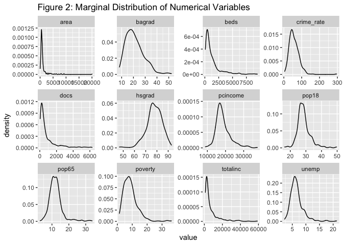
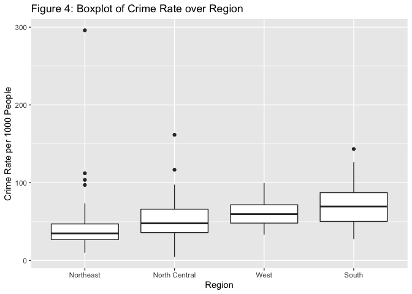
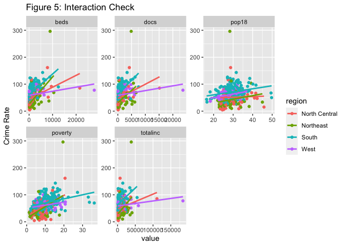
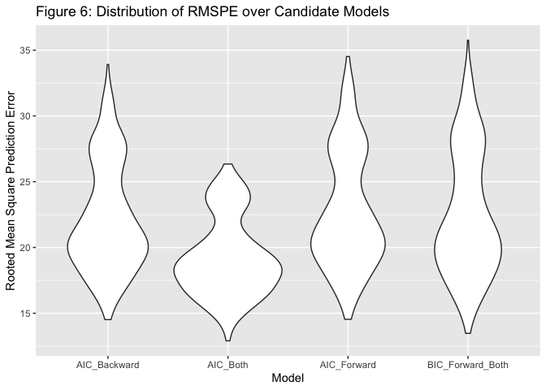
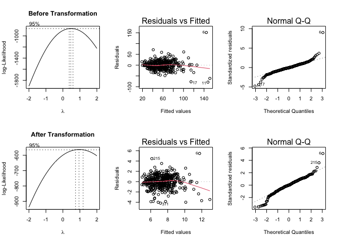
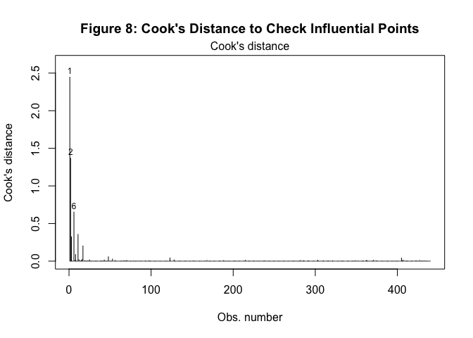

P8130 Final Project
================
Kaiyu He(kh3074), Yongzi Yu(yy3103), Ruiqi Yan(ry2417), Xueqing
Huang(xh2470), Hao Xu(hx2328)

### Abstract

Objective of this study is to predict the crime rate in counties. Data
visualization and automatic search procedure combined with AIC and BIC
are used for model selection. For model diagnostics, residuals plot and
QQ-plot are applied to test the assumptions of linear regression. Model
with influential points is compared by cross validation. Finally, our
results show that the transformation model is the best with more
significant variables, lower rmse, and higher adjusted r-squared . Our
final linear regression model includes variables percent of population
aged 18-34, percent of total population below poverty level, number of
hospital beds, number of active physicians, and geographic region.
Percent of population aged 18-34, percent of total population below
poverty level, and number of hospital beds have positive correlation to
crime rate, whereas number of active physicians have negative
correlation to crime rate.

### Introduction

According to Statista Research Department (Figure 1), the violent crime
rate in the United States was 398.5 cases per 100,000 of the population.
Even though the violent crime rate has been decreasing since 1990, the
United States tops the ranking of countries with the most prisoners. The
United States Federal Bureau of Investigation tracks the rate of
reported violent crimes per 100,000 U.S. inhabitants. In the timeline
above, rates are shown starting in 1990. The rate of reported violent
crime has fallen since a high of 758.20 reported crimes in 1991 to a low
of 361.6 reported violent crimes in 2014.  Using the CDI data set, we
want to analyze the potential relationship between crime rate and
several variables like percent high school graduates and percent below
poverty level. We will build a linear regression model to predict the
crime rate, and use the coefficient to illustrate the influence of each
variable on the crime rate.

### Data Description

Firstly we had a general check of the data. The variable we would like
to predict is the crime rate per 1000 population, which is not avalible
in the data. The key variable to dirive the crime rate is the total
serious crimes, and the total population. We ran a calculation to get
the crime rate by using the formula
$Crime Rate = \\frac{Total Serious Crimes}{\\frac{Total Population}{1000}}$. 
After the creation of the variable crime rate, we checked if there are
some unusual observations of crime rate, and the 4 city showed on (Table
1) represented unusual high crime rates, which are Kings in New York,
Dade in Florida, Fulton in Georgia, and St. Louis in Missouri. The ID
number, country name and state name cannot theoretically be used as
predictors of crime rates, and we calculated the crime rate using total
population and total serious crimes, so we dropped these variables for
our future analysis.  
We are also interested in the number observations of crime rate over
regions, which is the only categorical variable, and created a table
(Table 2) to visualize it. According to (Table 2), The number of
observations around regions are similar.   
Then, we checked the distribution of each numerical variables in the
data, including crime rate, and the distribution is shown on (Figure 2).
We discovered that the land area, percent Bachelor’s degrees, number of
hospital physicians, number of hospital beds, crime rate, number of
poverty, total personal income, and percent of unemployment had
left-skewed distributions, which means that most observations has low
value of these variables. The percent of high school graduates had
right-skewed distributions, which means that most of the observations
have high percentage of high school graduates. The percent population
aged between 18 and 34, percent population aged over 65, and per capita
income are normally distributed.

### Model Selection

After univariate analysis of the CDI data, the next step is fitting an
appropriate and robust regression model that could predict the crime
rate per 1000 people using other population characteristics in the data
set. The final model should be small and good, so we cautiously select
variables into the model.  
First of all, we use data visualization to help us add or drop variables
from the data set into the model. The pairwise scatter plots visualized
the bi-variate relationship of crime rate with each numeric predictor
variable(Figure 3). We do not detect any obvious curve-linear
relationship with crime rate among these variables, so we would not
consider any polynomial term. Some variables do not demonstrate the
noticeable pattern in the pairwise plot, implying no correlation with
the crime rate, so these predictors are out of consideration. The rest
of the numerical variables, including percent of population aged 18-34,
number of active physicians, number of hospital beds, percent of poverty
and total population income, are kept in the model. For the categorical
variable, geographic region, we drew box-plots to visualize the
distribution of crime rate by each region (Figure 4). There are
significantly different distributions of crime rates among regions, so
the geographic region is added to the model. Moreover, we consider
adding interaction terms. For each numeric variable selected in the
previous step, the Figure 5 checked whether its relationship with crime
rate varies among different regions. Besides percent of the population
aged 18-34, the other four numerical variables have substantially
steeper slopes of regression of Northeast than those of West, suggesting
a potentially different relationship with crime rate by region (Figure
5). Then, the interaction terms between these four variables and the
region are added to the model.  
The full model has six main effects and four interaction terms. It is
necessary to reduce the number of predictors to avoid over-fitting. We
used the automatic search procedure combined with criterions, AIC and
BIC, to select some subset models that optimize the measure of goodness
of fit. We perform backward elimination, forward selection and step-wise
regression with each criterion and get four different models as
candidates of our final model. The comparison of prediction ability is
an appropriate method to select the final model from these candidates,
and cross-validation is the efficient tool to measure. The original data
set is randomly split into a 20/80 partition as testing and training
sets pair respectively, and 500 random pairs are generated. For each
pair, the training data is used to fit each candidate model, and then
testing data is used to evaluate the performance for each fitted model
by calculating the rooted mean square prediction error. The lower
prediction error usually indicates higher prediction ability. Thus, we
could estimate the overall prediction error distribution for each
candidate model using 500 testing-training pairs shown in Figure 6 and
examine its prediction ability. The model selected through AIC step-wise
regression has the lowest prediction error across all candidate models,
so we select this model as the final model before transformation which
is processed in the model diagnostic part.

### Model Diagnotics

Transformation:  
Lamda = 0.5 is in the confidence level, thus we can fit the model with
transformation. To verify the assumptions of linear regression, fitted
values vs residuals plot and qq-plot are applied. Based on Figure 7,
after transformation, residuals have more constant variance since the
dots are more scattered around 0. QQ plot implies normality is met
because most points roughly form a straight line. In addition, adj-r
squared is higher (0.44 vs 0.43), which shows higher correlation and
better prediction results. Thus, a transformed model is chosen. 
Influential point:  Based on Cook’s distance plot (Figure 8), there are
three influential points such as row 1,2,6. Their Di &gt; 0.5. By
checking the value, the value seems correct and we decide to keep those
influential points in the model.  Multicollinearity:  
From Table 3, VIF scores above 1 implies that there is some correlation
between variables. However, since VIF scores are small (&lt;5), there is
not enough to be concerned about multicollinearity.

### Results

Finally we get to the following regression model.

$\\sqrt{CRM\_1000} = 4.15189 + 0.08105\\times poverty + 0.00066\\times beds - 0.93004 \\times I\\{region = Northeast\\} + 0.99089 \\times I\\{region = South\\} + 1.03623 \\times I\\{region = West\\} + 0.05991\\times pop18 - 0.00062 \\times docs + 0.00018 \\times beds \\times I\\{region = Northeast\\} - 0.00027\\times beds \\times I\\{region = South\\} - 0.00082 \\times beds \\times I\\{region = West\\} + 0.00016 \\times docs \\times I\\{region = Northeast\\} + 0.00062 \\times doc \\times I\\{region = South\\} + 0.00090 \\times docs \\times I\\{region = West\\}$  

According to our final outcome, percent below poverty level, number of
hospital beds, percent of the population aged between 18 and 34,
geographic region, number of active physicians, have a significant
influence on the crime rate of the county.  As for the region. This
dummy variable shows that counties in the South and West have about 1%
greater $\\sqrt{CRM1000}$ than North Central. And counties in the
Northeast are expected to have the least crime rate among four
geographic regions.  As for all continuous variables in the final model,
poverty has the most positive impact on the crime rate. The estimated
coefficient is 0.081, which increase $\\sqrt{CRM1000}$ by 0.081 percent
if the percent below the poverty level increases 1 percent in the
county.  The second primary influential variable is the percent of the
population aged between 18 and 34(pop18), pop18 also shows a positive
relationship with the crime rate. The estimated coefficient is 0.0599,
which means we will expect to see about 0.0599% additional
$\\sqrt{CRM1000}$ if the percent below the poverty level increases 1
percent in the county.  The number of active physicians, number of
hospital beds show a different relationship with the crime rate. 10000
additional active physicians will reduce the $\\sqrt{CRM1000}$ in the
county by 6.23% percent, on the other hand, 10000 additional hospital
beds will increase the $\\sqrt{CRM1000}$ in the county by 6.62%
percent.  Finally, there are 6 interaction terms that show 10000
additional active physicians will increase the $\\sqrt{CRM1000}$ by
1.57%, 6.24%, and 8.97% in Northeast, South, and West compared with
North Central. 10000 additional hospital beds will increase the
$\\sqrt{CRM1000}$ by 1.8% in the Northeast and decrease the
$\\sqrt{CRM1000}$ by 2.67%, 8.22% in the South and West compared with
NorthCentral.

### Conclusions and Discussion

Based on the final model, we find out that several factors have a
significant impact on crime rate and thus can be used to predict crime
rate in counties of the United States. These factors are percent of
population aged 18-34, percent of total population below poverty level,
number of hospital beds, number of active physicians, and geographic
region. Among those factors, the number of active physicians, the region
of Northeast compared to North Central, the number of hospital beds in
the region of South and West have a negative association on the crime
rate. The remaining factors have a positive association on the crime
rate.  
During the modeling process, we have some findings. First, we perform
backward elimination, forward selection and stepwise regression with AIC
and BIC criterions separately based on the set of potential predictors.
Among these six models, we find out that models built by forward
selection and stepwise regression with BIC are the same. Models built by
backward elimination with AIC and with BIC are the same. Therefore, we
only remain one of the same models as the candidate model. The four
candidate models are built with backward elimination with AIC, forward
selection with AIC, stepwise regression with AIC, and forward selection
with BIC. Second, by separately arranging column area and pop in the
original dataset from the smallest to the largest, we find that the area
and population of row 6 has the rank 11th and 435th in a total of 440
counties, respectively. This indicates that row 6, Kings of NY, has a
very high population density, and that’s the reason row 6 is a very
influential observation for our model. We have no idea whether there is
a data error of this observation.  
The strength of our project is that we choose models based on automatic
search procedures instead of merely subjective judgement based on
visualization. Also, we use the transformed model as our final result to
satisfy the assumptions of residuals to the greatest extent. We only
consider linear association between crime rate and factors that
influence crime rate. However, it is possible that crime rate and those
factors have a nonlinear association. If we consider nonlinear
association, the model might predict the crime rate in 440 counties in
the United States more accurately than the model we built in this
project.

### Reference

1.  Statista Research Department, Reported violent crime rate in the
    United States from 1990 to 2020,Sep 29, 2021, from
    <https://www.statista.com/statistics/191219/reported-violent-crime-rate-in-the-usa-since-1990/>

2.  Hadley Wickham (2020). modelr: Modelling Functions that Work with
    the Pipe. R package version 0.1.8.
    <https://CRAN.R-project.org/package=modelr>

3.  Wickham et al., (2019). Welcome to the tidyverse. Journal of Open
    Source Software, 4(43), 1686, <https://doi.org/10.21105/joss.01686>

4.  Elin Waring, Michael Quinn, Amelia McNamara, Eduardo Arino de la
    Rubia, Hao Zhu and Shannon Ellis (2021). skimr: Compact and Flexible
    Summaries of Data. R package version 2.1.3.
    <https://CRAN.R-project.org/package=skimr>

5.  Venables, W. N. & Ripley, B. D. (2002) Modern Applied Statistics
    with S. Fourth Edition. Springer, New York. ISBN 0-387-95457-0

6.  Thomas Lumley based on Fortran code by Alan Miller (2020). leaps:
    Regression Subset Selection. R package version 3.1.
    <https://CRAN.R-project.org/package=leaps>

7.  Lüdecke et al., (2021). performance: An R Package for Assessment,
    Comparison and Testing of Statistical Models. Journal of Open Source
    Software, 6(60),

8.  <https://doi.org/10.21105/joss.03139>

### Appendix I: Figure and Table

#### Figure 1: Crime Rate between 1990-2020

  
  


| state | crime\_rate | cty       |
|:------|------------:|:----------|
| NY    |    295.9867 | Kings     |
| FL    |    126.3362 | Dade      |
| GA    |    143.3467 | Fulton    |
| MO    |    161.5967 | St.\_Loui |

Outliers in Crime Rate

| region        |   n |
|:--------------|----:|
| North Central | 108 |
| Northeast     | 103 |
| South         | 152 |
| West          |  77 |

Number of Observations in Each Region

<!-- --><!-- --><!-- --><!-- --><!-- -->

#### Figure 7. Assumptions of linear regression check before and after transformation

  
  
<!-- -->

<!-- -->

| Term    |      VIF | SE\_factor |
|:--------|---------:|-----------:|
| poverty | 2.149675 |   1.466177 |
| beds    | 1.773850 |   1.331859 |
| region  | 1.761193 |   1.327100 |
| pop18   | 1.183588 |   1.087928 |
| docs    | 2.407664 |   1.551665 |

Table 3: Multicolinearity Check

### Apendix II: R Code

``` r
# data clean (calculate crime_rate (1000 people))
crime_rate_df = read_csv("data/cdi.csv") %>%
  mutate(crime_rate = crimes /(pop/1000),
         region = case_when(
    region == 1 ~ "Northeast",
    region == 2 ~ "North Central",
    region == 3 ~ "South",
    region == 4 ~ "West"
  ),
  region = factor(region))
# check outliers
OutVals = boxplot(crime_rate_df$crime_rate)$out
```

``` r
crime_rate_df %>% 
  dplyr::filter(crime_rate %in% OutVals) %>% 
  dplyr::select(state, crime_rate, cty) %>% 
  knitr::kable(caption = "Outliers in Crime Rate")

crime_rate_df %>% 
  group_by(region) %>% 
  count() %>% 
  knitr::kable(caption = "Number of Observations in Each Region") 

# numeric variables
crime_rate_df_numeric  =
  crime_rate_df%>%
  dplyr::select(area,pop18,pop65,docs,beds,hsgrad,bagrad,poverty,unemp,
                pcincome,totalinc,crime_rate)%>%
  filter(beds<10000,docs<10000)

# marginal distribution
crime_rate_df_numeric %>%
  pivot_longer(area:crime_rate,names_to = "predictors",values_to = "value")%>%
  ggplot(aes(x = value))+
  geom_density()+
  facet_wrap(.~predictors,scales = "free") + 
  labs(
    title = "Figure 2: Marginal Distribution of Numerical Variables"
  )

## Variable Selection
# numerical variables
crime_rate_df %>%
  dplyr::select(crime_rate,area,pop18,pop65,docs,beds,hsgrad,bagrad,
                poverty,unemp,totalinc,pcincome) %>%
  pivot_longer(area:pcincome, names_to = "predictor", values_to = "value") %>%
  ggplot(aes(x = value, y = crime_rate)) +
  geom_point() +
  geom_smooth(method = "lm", se = F) +
  facet_wrap(.~predictor, scales = "free") +
  labs(title = "Figure 3: Scatterplots of crime rate vs. numerical predictor variables",
       x = "Predictor Variable",
       y = "Crime Rate Per 1000 People")

#categorical variable
crime_rate_df%>%
  ggplot(aes(x = fct_reorder(region,crime_rate),y=crime_rate))+
  geom_boxplot() + 
  labs(
    title = "Figure 4: Boxplot of Crime Rate over Region",
    x = "Region",
    y = "Crime Rate per 1000 People"
  )

crime_rate_df_all = crime_rate_df %>%
  dplyr::select(crime_rate,pop18,docs,beds,poverty,totalinc,region)

#interaction term
crime_rate_df_all %>%
  pivot_longer(pop18:totalinc, names_to = "predictor", values_to = "value") %>%
  ggplot(aes(x = value,y = crime_rate,color = region)) +
  geom_point() +
  geom_smooth(method = "lm",se = F) +
  facet_wrap(.~predictor, scales = "free") +
  labs(
    title = "Figure 5: Interaction Check",
    y = "Crime Rate"
  )
```

``` r
#stepwise procedure with AIC and BIC
lm0 = lm(data = crime_rate_df_all, crime_rate ~ pop18 + docs + beds + 
           poverty + totalinc + region + docs*region + beds*region + 
           poverty*region + totalinc*region)

step(lm0 , direction = "backward", scope = ~pop18 + docs + beds +
       poverty + totalinc + region + docs*region + beds*region + 
       poverty*region + totalinc*region)
lm1_AIC_Backward = lm(formula = crime_rate ~ pop18 + docs + beds +
                        poverty + totalinc + region + docs:region +
                        poverty:region + totalinc:region, 
    data = crime_rate_df_all)

lm_null = lm(crime_rate ~ NULL, data = crime_rate_df_all)

step(lm_null,direction = "forward", scope = ~pop18 + docs + beds +
       poverty + totalinc + region + docs*region + beds*region +
       poverty*region + totalinc*region)

lm2_AIC_Forward = lm(formula = crime_rate ~ poverty + beds + region + 
                       pop18 + docs + beds:region + poverty:region +
                       region:docs, data = crime_rate_df_all)

step(lm_null,direction = "both", scope = ~pop18 + docs + beds +
       poverty + totalinc + region + docs*region + beds*region +
       poverty*region + totalinc*region)

lm3_AIC_Both = lm(formula = crime_rate ~ poverty + beds + region +
                    pop18 + docs + 
    beds:region + region:docs, data = crime_rate_df_all)

step(lm_null,direction = "forward", k = log(nrow(crime_rate_df)), 
     scope = ~pop18 + docs + beds + poverty + totalinc + region + 
       docs*region + beds*region + poverty*region + totalinc*region)

lm4_BIC_Forward_Both = lm(formula = crime_rate ~ poverty + beds + region +
                            pop18 + beds:region, 
    data = crime_rate_df_all)
```

``` r
library(modelr)
set.seed(1200)
#cross-validation
cv_df <-
  crossv_mc(crime_rate_df_all, 500)
cv_df <-
  cv_df %>% 
  mutate(
    train = map(train, as_tibble),
    test = map(test, as_tibble)
  )

cv_df_result <-
  cv_df %>% 
  mutate(
    lm1_AIC_Backward = map(.x = train, ~lm(crime_rate ~ pop18 +
                                             docs + beds + poverty + 
                                             totalinc + region + docs:region +
                                             poverty:region + totalinc:region,
                                           data = .x)),
    lm2_AIC_Forward = map(.x = train, ~lm(crime_rate ~ pop18 + docs +
                                            beds + poverty + totalinc + 
    region + docs:region + beds:region + poverty:region + totalinc:region,
    data = .x, )),
    lm3_AIC_Both = map(.x = train, ~lm(crime_rate ~ poverty + beds + region +
                                         pop18 + docs + 
    beds:region + region:docs, data = crime_rate_df_all)),
    lm4_BIC_Forward_Both = map(.x = train, ~lm(crime_rate ~ poverty + beds +
                                                 region + pop18 + beds:region,
                                               data = .x))
    ) %>% 
  mutate(
    rmse_AIC_Backward = map2_dbl(.x = lm1_AIC_Backward,
                                 .y = test, 
                                 ~rmse(model = .x, data = .y)),
    rmse_AIC_Forward = map2_dbl(.x = lm2_AIC_Forward, .y = test,
                                ~rmse(model = .x, data = .y)),
    rmse_AIC_Both = map2_dbl(.x = lm3_AIC_Both, .y = test, 
                             ~rmse(model = .x, data = .y)),
    rmse_BIC_Forward_Both = map2_dbl(.x = lm4_BIC_Forward_Both, 
                                     .y = test, 
                                     ~rmse(model = .x, data = .y))
  )

cv_df_result %>% 
  dplyr::select(starts_with("rmse")) %>% 
  pivot_longer(
    rmse_AIC_Backward:rmse_BIC_Forward_Both,
    names_to = "model",
    values_to = "rmse",
    names_prefix = "rmse_"
  ) %>% 
  ggplot(aes(x = model, y = rmse)) +
  geom_violin() +
  labs(
    title = "Figure 6: Distribution of RMSPE over Candidate Models",
    x = "Model",
    y = "Rooted Mean Square Prediction Error"
  )
```

``` r
## Model Diagnostic
lm3_AIC_Both = lm(formula = crime_rate ~ poverty + beds + region + 
                    pop18 + docs + 
    beds:region + region:docs, data = crime_rate_df_all)

crime_rate_df_transform = crime_rate_df_all %>% 
  mutate(crime_rate = sqrt(crime_rate))

lm3_AIC_Both_transform = lm(formula = crime_rate ~ poverty + 
                              beds + region + pop18 + docs + 
    beds:region + region:docs, data = crime_rate_df_transform)

lm3_without_interaction = lm(formula = crime_rate ~ poverty + 
                               beds + region + pop18 + docs,
                             data = crime_rate_df_all)
```

``` r
#transformation
par(mfrow = c(2,3))
boxcox(lm3_AIC_Both)
title("Before Transformation")
plot(lm3_AIC_Both ,which = 1)
plot(lm3_AIC_Both ,which = 2)
boxcox(lm3_AIC_Both_transform)
title("After Transformation")
plot(lm3_AIC_Both_transform,which = 1)
plot(lm3_AIC_Both_transform,which = 2)
```

``` r
#influential points
plot(lm3_AIC_Both_transform,which = 4,sub.caption = "")
title("Figure 8: Cook's Distance to Check Influential Points")
```

``` r
#multicolinearity
check_collinearity(lm3_without_interaction) %>% 
  knitr::kable(caption = "Table 3: Multicolinearity Check")
```
